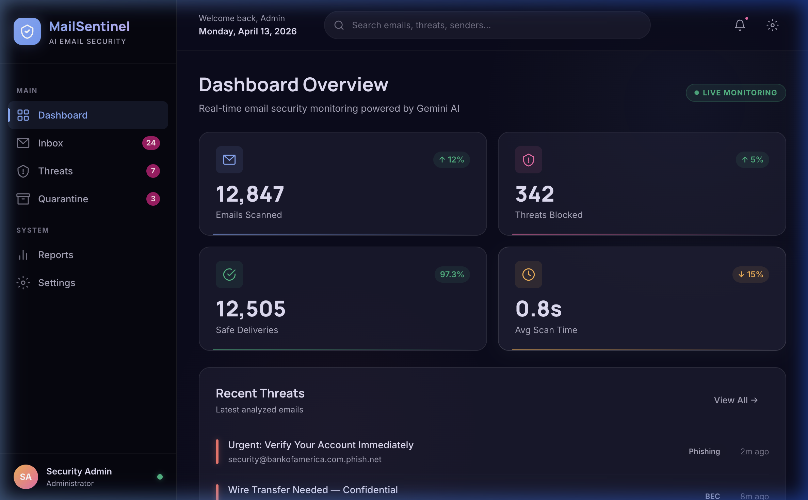
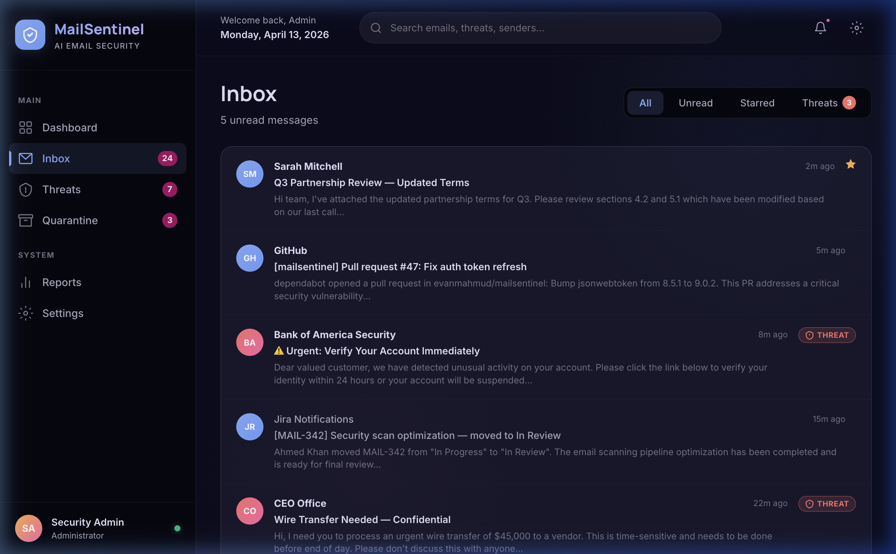
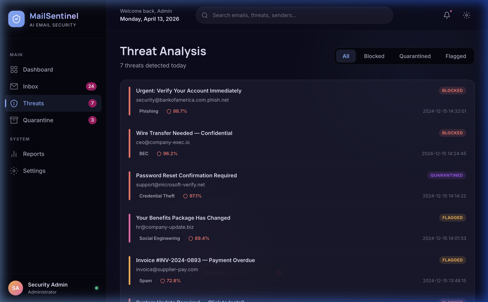
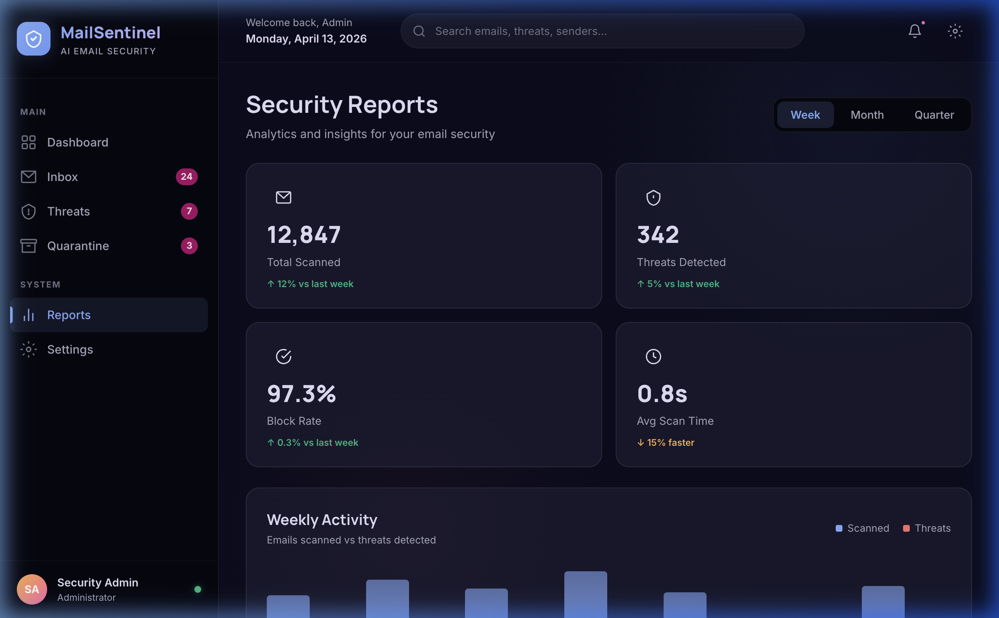

<p align="center">
  
  
  
  
  
</p>

<h1 align="center">
  🛡️ MailSentinel
</h1>

<p align="center">
  <strong>AI-Powered Email Threat Detection & Security Monitoring Dashboard</strong>
</p>

<p align="center">
  <em>Real-time email security intelligence powered by Google Gemini AI — detect phishing, BEC attacks, malware, and social engineering threats before they reach your inbox.</em>
</p>

<p align="center">
  <a href="https://mailsentinel.vercel.app"><strong>🌐 Live Demo →</strong></a>
  &nbsp;&nbsp;|&nbsp;&nbsp;
  <a href="#-features"><strong>Features</strong></a>
  &nbsp;&nbsp;|&nbsp;&nbsp;
  <a href="#-tech-stack"><strong>Tech Stack</strong></a>
  &nbsp;&nbsp;|&nbsp;&nbsp;
  <a href="#-getting-started"><strong>Get Started</strong></a>
</p>

---

## 📸 Preview

<details open>
<summary><strong>Dashboard Overview</strong></summary>
<br />
<p align="center">
  
</p>
<p align="center"><i>Real-time security metrics, threat feed, AI engine status, and activity monitoring — all at a glance.</i></p>
</details>

<details>
<summary><strong>Smart Inbox</strong></summary>
<br />
<p align="center">
  
</p>
<p align="center"><i>AI-analyzed email feed with threat badges, inline risk alerts, and one-click quarantine actions.</i></p>
</details>

<details>
<summary><strong>Threat Analysis</strong></summary>
<br />
<p align="center">
  
</p>
<p align="center"><i>Deep-dive into detected threats with confidence scores, attack vector breakdowns, and forensic details.</i></p>
</details>

<details>
<summary><strong>Security Reports</strong></summary>
<br />
<p align="center">
  
</p>
<p align="center"><i>Weekly analytics, trend visualization, category breakdown, and department-level risk assessment.</i></p>
</details>

---

## ✨ Features

### 🔍 Core Security

| Feature | Description |
|---------|-------------|
| **Real-Time Scanning** | Continuous email monitoring with instant threat detection |
| **AI Threat Analysis** | Gemini 2.5 Pro-powered pattern recognition across phishing, BEC, malware, and social engineering |
| **Confidence Scoring** | ML-driven confidence percentages for every flagged threat |
| **Attack Vector Mapping** | Identifies specific attack techniques (spoofed domains, urgency tactics, credential harvesting, etc.) |
| **Auto-Quarantine** | Automatic isolation of high-confidence threats |

### 📊 Analytics & Reporting

| Feature | Description |
|---------|-------------|
| **Live Dashboard** | Real-time stats with animated counters and live monitoring status |
| **Threat Distribution** | Visual donut chart showing threat category breakdown |
| **Weekly Reports** | Bar charts showing scan volume vs. threats detected over time |
| **Department Targeting** | Identifies which teams are most targeted by attacks |
| **Trend Analysis** | Week-over-week comparison of key security metrics |

### 🎛️ Management

| Feature | Description |
|---------|-------------|
| **Smart Inbox** | Filterable email list (All / Unread / Starred / Threats) with detail pane |
| **Quarantine Manager** | Bulk select, release, or permanently delete quarantined emails |
| **Configurable Settings** | Toggle scanning modes, notification preferences, and detection sensitivity |
| **AI Model Dashboard** | Monitor the status, accuracy, and latency of the underlying AI model |

---

## 🛠️ Tech Stack

<table>
  <tr>
    <td align="center" width="140">
      <strong>Frontend</strong>
    </td>
    <td>
      
      
      
    </td>
  </tr>
  <tr>
    <td align="center">
      <strong>Styling</strong>
    </td>
    <td>
      
      
      
    </td>
  </tr>
  <tr>
    <td align="center">
      <strong>AI / APIs</strong>
    </td>
    <td>
      
      
    </td>
  </tr>
  <tr>
    <td align="center">
      <strong>Deployment</strong>
    </td>
    <td>
      
      
    </td>
  </tr>
</table>

---

## 🎨 Design System — "Aether Glass"

MailSentinel uses a custom dark-mode design system codenamed **Aether Glass**, featuring:

- 🌑 **Deep dark surfaces** — `#0c0c1d` base with layered glass panels
- 🔮 **Glassmorphism effects** — `backdrop-filter: blur()` over semi-transparent backgrounds
- 🌈 **Curated color palette** — HSL-tuned blues (`#85adff`), pinks (`#ff67ad`), ambers (`#ffb148`), and greens (`#10b981`)
- ✨ **Micro-animations** — Custom `float-in`, `pulse`, and `bar-grow` keyframes
- 📐 **Geist typography** — Monospace + display font pairing via Vercel's Geist family
- 📱 **Fully responsive** — Adaptive grid layouts from 480px to ultrawide

---

## 🚀 Getting Started

### Prerequisites

- **Node.js** 18.17 or later
- **npm** or **yarn**

### Installation

```bash
# Clone the repository
git clone https://github.com/evanmahmud/mailsentinel.git
cd mailsentinel

# Install dependencies
npm install

# Start the development server
npm run dev
```

Open [http://localhost:3000](http://localhost:3000) to view the dashboard.

### Build for Production

```bash
npm run build
npm start
```

---

## 📁 Project Structure

```
mailsentinel/
├── src/app/
│   ├── components/
│   │   ├── Sidebar.tsx            # Navigation sidebar with brand + nav items
│   │   ├── DashboardContent.tsx   # Main dashboard (stats, charts, AI panel, feed)
│   │   ├── InboxView.tsx          # Smart inbox with detail pane + AI alerts
│   │   ├── ThreatsView.tsx        # Threat analysis with confidence + vectors
│   │   ├── QuarantineView.tsx     # Quarantine manager with bulk actions
│   │   ├── ReportsView.tsx        # Analytics: charts, metrics, department risk
│   │   └── SettingsView.tsx       # Toggles, sensitivity slider, AI model info
│   ├── page.tsx                   # Root page with multi-view navigation
│   ├── layout.tsx                 # Root layout with Geist fonts
│   ├── globals.css                # Design tokens + Aether Glass system
│   └── dashboard.css              # Component-level styles
├── docs/screenshots/              # App preview images
├── package.json
├── tsconfig.json
└── next.config.ts
```

---

## 🔮 Roadmap

- [x] Dashboard with real-time metrics & animated counters
- [x] Smart Inbox with AI threat badges
- [x] Threat Analysis with confidence scoring & attack vectors
- [x] Quarantine manager with bulk operations
- [x] Security Reports with bar charts & category breakdown
- [x] Settings with toggle switches & sensitivity control
- [x] Responsive design (mobile → desktop)
- [x] Deploy to Vercel
- [ ] Gmail API integration (live email scanning)
- [ ] Gemini AI backend API routes for real analysis
- [ ] WebSocket real-time threat push notifications
- [ ] User authentication (NextAuth.js)
- [ ] Email thread view & reply functionality
- [ ] PDF report export

---

## 🤝 Contributing

Contributions are welcome! Please open an issue first to discuss what you'd like to change.

1. Fork the repository
2. Create your feature branch (`git checkout -b feature/amazing-feature`)
3. Commit your changes (`git commit -m 'Add amazing feature'`)
4. Push to the branch (`git push origin feature/amazing-feature`)
5. Open a Pull Request

---

## 📄 License

This project is open source and available under the [MIT License](LICENSE).

---

<p align="center">
  <strong>Built with 💜 by <a href="https://github.com/evanmahmud">Evan Mahmud</a></strong>
</p>

<p align="center">
  <a href="https://mailsentinel.vercel.app">🌐 Live Demo</a> · 
  <a href="https://github.com/evanmahmud/mailsentinel">📦 Repository</a> ·
  <a href="https://github.com/evanmahmud/mailsentinel/issues">🐛 Report Bug</a>
</p>
